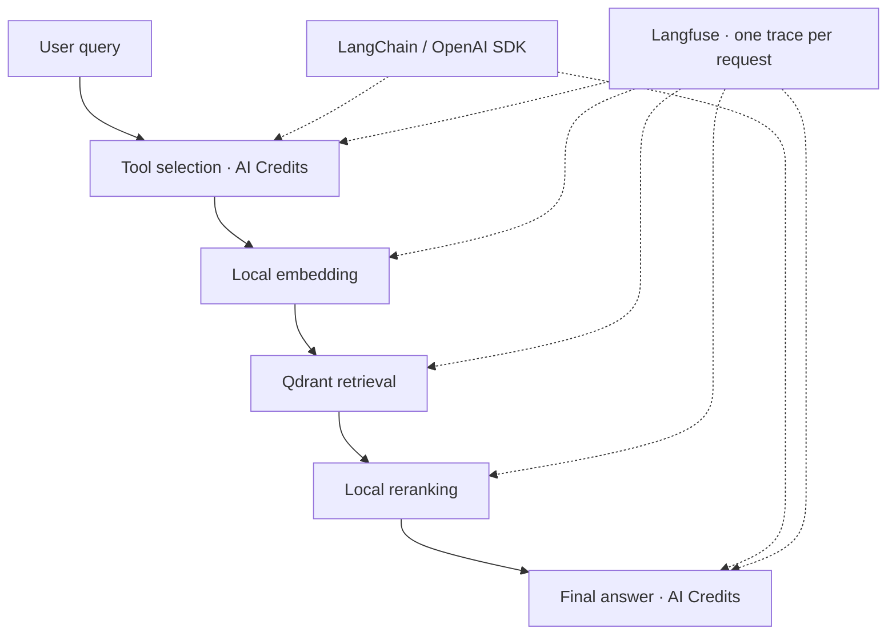

# MultiHop-RAG

<!-- evaluation-dashboard:start -->

**Awaiting first evaluation.** No paid evaluation has populated this dashboard yet.

<!-- evaluation-dashboard:end -->

**LLM:** `inclusionai/ling-3.0-flash`

**Sources:** [MultiHop-RAG — Yixuan Tang & Yi Yang (2024)](https://arxiv.org/abs/2401.15391) · [AI Credits](https://aicredits.in)

