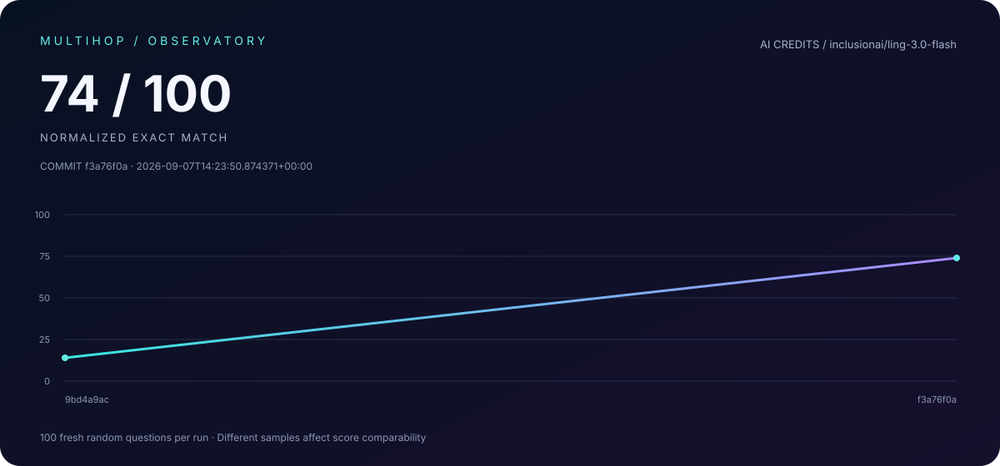

# MultiHop-RAG

<!-- evaluation-dashboard:start -->

**Latest: 14/100 normalized exact matches** · Errors: 27 · Updated: 2026-09-05T13:45:50.223226+00:00

| Evaluated commit | Matches | Errors | UTC timestamp |
| :-- | --: | --: | :-- |
| `9bd4a9ac` | 14/100 | 27 | 2026-09-05T13:45:50.223226+00:00 |

[Latest answers](results.csv) · [Full history](evaluation/history.csv)

<!-- evaluation-dashboard:end -->

**LLM:** `inclusionai/ling-3.0-flash`

**Sources:** [MultiHop-RAG — Yixuan Tang & Yi Yang (2024)](https://arxiv.org/abs/2401.15391) · [AI Credits](https://aicredits.in)
